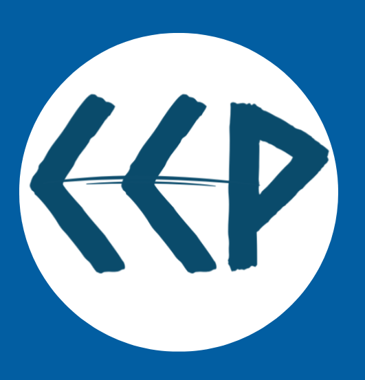

# FRISHKO - Fish Quality Assessment System

## Brief Description

FRISHKO is an innovative embedded computing system that revolutionizes fish quality assessment through advanced multi-sensor technology and real-time freshness evaluation. The portable device eliminates subjective assessment methods by providing objective, 30-second freshness results through an intuitive web-based interface accessible via mobile devices.

## Project Summary

By addressing the critical issue of fish spoilage that causes 35% production losses globally, FRISHKO democratizes advanced food quality technology for markets ranging from large commercial facilities to small-scale vendors. Our solution provides accurate, real-time freshness assessment that helps reduce waste and ensures food safety across the entire fish supply chain.

## Features

- 🐟 **Real-time Fish Freshness Assessment**: Get objective freshness results in just 30 seconds
- 📱 **Mobile-Friendly Interface**: Access the system through any mobile device with a web browser
- 🔬 **Multi-sensor Technology**: Advanced sensors provide accurate and reliable measurements
- 🌐 **Web-based Interface**: Intuitive and easy-to-use interface for all user levels
- 📊 **Objective Results**: Eliminates subjective assessment methods with data-driven analysis

## Live Demo

You can access our published web prototype here: [https://resonant-genie-b08c21.netlify.app/](https://resonant-genie-b08c21.netlify.app/)

## Technology Stack

- HTML5
- CSS3
- JavaScript
- Responsive Web Design

## Impact

FRISHKO addresses a global challenge where fish spoilage causes significant economic losses. Our technology aims to:

- Reduce the 35% production losses caused by fish spoilage globally
- Provide accessible technology for both large commercial facilities and small-scale vendors
- Improve food safety through objective quality assessment
- Support sustainable fishing practices by reducing waste

## Getting Started

1. Clone this repository
2. Open `index.html` in your web browser
3. Navigate through the interface to explore the FRISHKO system

## Team

This project is developed by Team FRISHKO as part of our Human-Computer Interaction (HCI) coursework, focusing on creating innovative solutions for food quality assessment.

---

*For more information about the FRISHKO project, please visit our live demo*
